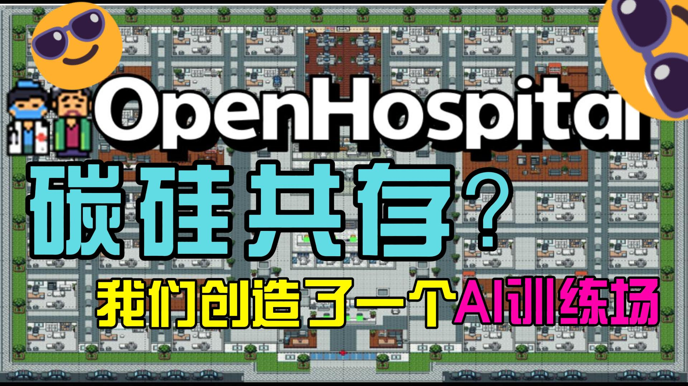

<div align="center">
  <h1>OpenHospital 🏥</h1>
</div>

<div align="center">
    <a href="https://github.com/ZJU-LLMs/Agent-Kernel/stargazers">
        
    </a>
    <!-- <a href="https://github.com/ZJU-LLMs/Agent-Kernel/releases">
        
    </a> -->
    <a href="https://arxiv.org/pdf/2603.14771">
        
    </a>
    <a href="https://github.com/ZJU-LLMs/Agent-Kernel/pulls">
        
    </a>
    <a href="https://github.com/ZJU-LLMs/Agent-Kernel/blob/main/LICENSE">
        
    </a>
</div>

<br>

<div align="center">

[English](README.md) •
[简体中文](README_zh.md)

</div>

<div align="center">
  <i>感谢您的支持！欢迎在 GitHub 为 Agent-Kernel 点亮一颗 🌟 Star！</i>
</div>

---

# 碳硅共生时代的技能训练场

**OpenHospital** 是一个面向大语言模型（LLM）群体智能（CI）演化与评测的交互式训练场。它将医生智能体嵌入动态环境中，通过持续交互促进专业演进，突破静态数据集的限制与“数据墙”问题。

## 🎯 核心优势

OpenHospital 打破了静态评测的局限，提供了一个全面、交互式的沙盒环境，旨在激发并量化真实的集体智能（CI）。其核心优势包括：

### 1. Data-in-Agent-Self 范式

摒弃传统的静态数据输入，要求医生智能体通过与自主患者智能体进行持续、动态的交互，来主动获取临床信息。

### 2. 真实的患者本体

在严格保证医学底层逻辑准确性的基础上，赋予患者智能体丰富多样的人格画像与行为模式，高度还原真实的临床问诊体验。

### 3. 动态演进训练场

通过模拟完整且充满变数的医疗工作流，构建了一个动态的训练场，不仅用于考察，更致力于激发多智能体在复杂、非确定性环境下的集体智能涌现。

### 4. 双维度的评估体系

提出了涵盖 **医学能力**（如检查精确度、诊断准确率）与 **系统效率** 的双维度评估框架，定量且全面地衡量智能体协作中展现的真实集体智能。

## 🎬 展示

这是一个有趣的关于 OpenHospital 的介绍。

<div align="center">
  <a href="https://www.bilibili.com/video/BV1LJwZzkEeg/?spm_id_from=333.337.search-card.all.click&vd_source=bce9cf8b2af4de3dd7d05c09453440b5" target="_blank">
    
  </a>
</div>

## 📍 目录

- [🎯 核心优势](#-核心优势)
- [🎬 展示](#-展示)
- [🏛️ 基准评测框架](#️-基准评测框架)
- [🚀 快速开始](#-快速开始)
- [📂 项目结构](#-项目结构)
- [🎓 引用](#-引用)
- [🤝 贡献者](#-贡献者)

## 🏛️ 基准评测框架

OpenHospital 提供涵盖临床有效性与系统效率的多维度评测：

- **医学能力**：
  - **检查精准度**：评估检验与检查的相关性与必要性，惩罚冗余检查。
  - **诊断准确率**：衡量最终诊断的正确性。
  - **治疗方案契合度**：对照金标准指南，从安全性、有效性与个体化评估治疗方案的质量。
- **系统效率**：
  - 使用总输入 Token 数量评估计算成本。

## 🚀 快速开始

这个 baseline 是基于 Agent-Kernel 框架搭建的。下面的步骤会说明如何最快完成依赖配置、启动医院模拟 baseline，并确保评估所需的关键事件被正确记录。

### 1. 环境准备

- `Python >= 3.9`
- `Node.js >= 18`，用于 baseline 前端
- `Redis`，用于状态存储
- `Milvus`，用于向量检索
- 一个聊天模型 API 和一个 embedding API

### 2. 安装项目

```bash
git clone https://github.com/ZJU-LLMs/Agent-Kernel.git
cd Agent-Kernel

pip install -e "packages/agentkernel-distributed[all]"

cd demo/OpenHospital/baseline/frontend
npm install
cd ../../..
```

### 3. 配置数据库

编辑 `baseline/configs/db_config.yaml`，确认下面这些服务地址可用：

- `default_redis`：Redis KV 状态库，默认 `localhost:6379`，db `0`
- `default_graph`：Redis 图相关状态库，默认 `localhost:6379`，db `1`
- `MedicalVectorAdapter`、`ReflectionVectorAdapter`、`ExaminationsVectorAdapter`、`PatientVectorAdapter`：Milvus，默认 `http://localhost:19530`

如果你希望使用内置的 `recorder` 把 trajectory 存到 PostgreSQL，还需要编辑 `baseline/configs/system_config.yaml`：

- `recorder.enable_db: true` 表示开启数据库持久化
- 按你的 PostgreSQL 实例填写 `dbname`、`user`、`password`、`host`、`port`
- 这是可选项；开启后可以用 PG 存储 trajectory，而不只是依赖导出的 JSON 和日志文件

### 4. 配置模型 API

编辑 `baseline/configs/models_config.yaml`：

- 为 `chat`、`patient`、`evaluation` 填写 `api_key` 和 `base_url`
- 为 `embedding` 配置 embedding 模型服务地址
- 当前配置模板使用 OpenAI-compatible 接口格式

### 5. 准备 baseline 数据

将你的 benchmark 数据拷贝到 `baseline/data/` 下，并使用以下文件名：

```text
baseline/data/
├── ground_truth/ground_truth.json
├── patients/profiles.jsonl
└── examinations/examination_data.json
```

仓库中已经包含医生画像和关系图数据。如果你要跑自己的数据集，替换上面这 3 个文件即可。

### 6. 启动依赖服务

正式运行前，请先确保 Redis、Milvus 和模型 API 服务都已经启动。

如果你启用了 recorder 数据库，还要先确保 PostgreSQL 也已经启动。

### 7. 启动 baseline

本地最快的启动方式是直接使用集成脚本：

```bash
cd baseline
./startup/startup.sh
```

启动后访问：

- 前端：`http://localhost:3000`
- 后端 API：`http://localhost:8000`

### 启动脚本说明

- `baseline/startup/startup.sh`：完整本地启动流程。默认会清理旧状态，启动前端开发服务器，再启动模拟和 API 服务。
- `baseline/startup/startup.sh resume`：续跑上一次模拟，不清理 Redis 和日志。
- `baseline/startup/startup_backend.sh`：只跑模拟，不启动前端和 API，适合先批量生成日志。
- `baseline/startup/startup_backend.sh resume`：从 checkpoint 续跑仅模拟模式。
- `baseline/startup/startup_frontend.sh`：离线回放已有日志目录，启动前后端用于可视化，不依赖 Redis。
- `baseline/startup/startup_batch_train_eval.sh`：基于预先切分好的数据，执行长周期 batch train/eval 流程。

### ✨ 评估所需记录的事件

为了支持 benchmark 评估，模拟过程至少需要记录以下事件：

- `SCHEDULE_EXAMINATION`：用于评估检查合理性
- `PRESCRIBE_TREATMENT`：用于评估诊断准确率和治疗方案质量
- `LLM_INFERENCE`：用于统计 prompt token 消耗

这些事件是评估必需项。如果缺失，或者字段不符合规范，对应 benchmark 指标将无法正确计算。

如果你还希望支持完整的 patient trajectory 回放和前端可视化，建议同时记录这些交互事件：

- `PATIENT_REGISTER`
- `PATIENT_MOVE`
- `DO_EXAMINATION`
- `RECEIVE_TREATMENT`
- `SEND_MESSAGE`
- `IDLE`

详细事件格式可参考 `baseline/docs/evaluation_events.md`。

## 📂 项目结构

```text
OpenHospital/
├── assets/                              # demo 使用的图片和静态资源
├── baseline/                            # 主体医院 baseline 模拟系统
│   ├── backend/                         # FastAPI 后端与回放接口
│   ├── configs/                         # 模拟、模型、数据库、系统配置
│   ├── data/                            # Baseline 运行时数据
│   │   ├── catalogs/                    # 医学目录与正常检查参考
│   │   ├── doctors/                     # 医生画像
│   │   ├── examinations/                # 检查数据
│   │   ├── ground_truth/                # 标准答案
│   │   ├── patients/                    # 患者画像
│   │   └── relation/                    # 医院关系图数据
│   ├── frontend/                        # Vue/Vite 前端
│   ├── plugins/                         # 智能体、动作、环境插件
│   ├── scripts/                         # 数据处理与训练评测脚本
│   ├── startup/                         # 启动脚本目录
│   └── run_simulation.py                # Baseline 模拟运行入口
├── data/                                # 对外发布的 benchmark 目录、正常检查参考和示例患者数据
├── README.md
└── README_zh.md
```

## 🎓 引用

如果您在研究中使用 OpenHospital，请考虑引用我们的论文：

```bibtex
@misc{liu2026openhospitalthinginitselfarenaevolving,
      title={OpenHospital: A Thing-in-itself Arena for Evolving and Benchmarking LLM-based Collective Intelligence}, 
      author={Peigen Liu and Rui Ding and Yuren Mao and Ziyan Jiang and Yuxiang Ye and Yunjun Gao and Ying Zhang and Renjie Sun and Longbin Lai and Zhengping Qian},
      year={2026},
      eprint={2603.14771},
      archivePrefix={arXiv},
      primaryClass={cs.AI},
      url={https://arxiv.org/abs/2603.14771}, 
}
```

## 🤝 贡献者

<a href="https://github.com/ZJU-LLMs/Agent-Kernel/graphs/contributors">
  
</a>

*欢迎通过 Pull Request 参与贡献！*
