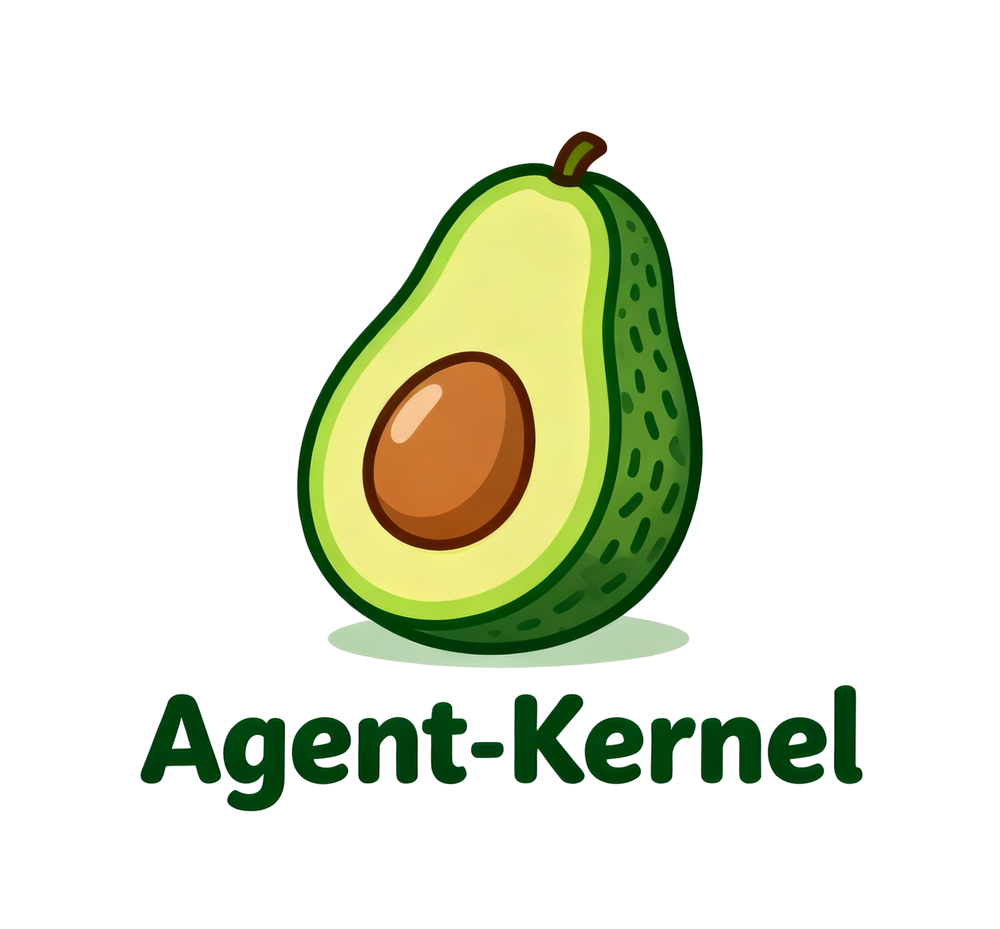

<p align="center">
  
</p>

# Agent-Kernel Distributed

**Agent-Kernel Distributed** is a distributed Multi-Agent System (MAS) framework designed to support large-scale environments using **Ray** for distributed execution.  
It is ideal for coordinating multiple intelligent agents running across different nodes or processes.

---

## 🚀 QuickStart

### 1. Requirements

- `Python ≥ 3.11`
- `uv`

Install `uv`:

```bash
# Linux/macOS
curl -LsSf https://astral.sh/uv/install.sh | sh

# Windows (PowerShell)
powershell -c "irm https://astral.sh/uv/install.ps1 | iex"

# or via pip
pip install uv
```

### 2. Clone and setup environment

```bash
git clone https://github.com/ZJU-LLMs/Agent-Kernel.git
cd Agent-Kernel
uv venv
# Linux/macOS
source .venv/bin/activate
# Windows PowerShell
# .venv\Scripts\Activate.ps1
```

### 3. Install Agent-Kernel Distributed

- `web` → `aiohttp`, `fastapi`, `uvicorn`
- `storages` → `asyncpg`, `pymilvus`, `redis`
- `all` → includes both `web` and `storages`

> You can add extras with `.[web]`, `.[storages]`, or `.[all]` after the package path.

```bash
cd packages/agentkernel-distributed
# base install
uv pip install -e .

# with optional features:
# uv pip install -e ".[web]"
# uv pip install -e ".[storages]"
# uv pip install -e ".[all]"
```

- Ray will be installed automatically as a dependency.
- You no longer need to manually start a Ray cluster — the framework handles it when required.

### 4. Run example simulation

```bash
uv run python -m examples.distributed_test.run_simulation
```
